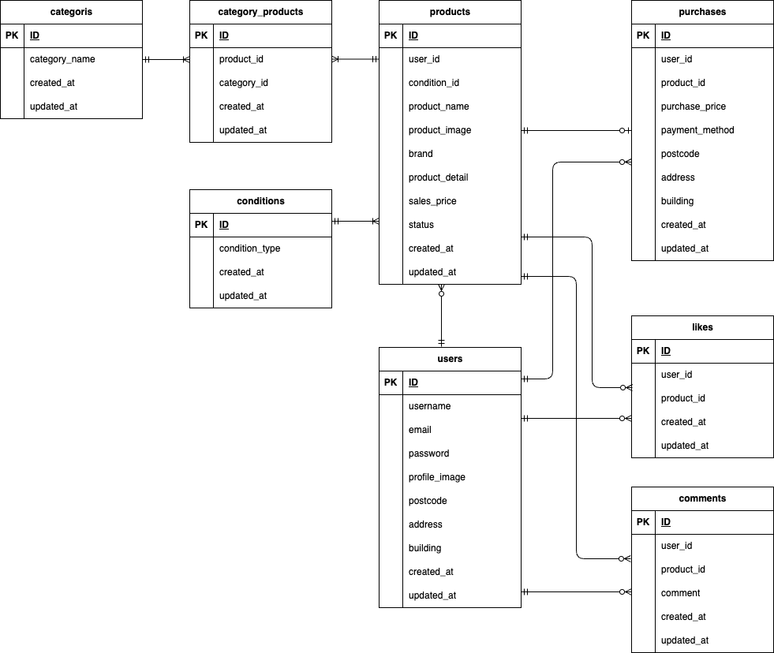

# coachtechフリマ(フリーマーケットアプリ)

## coachtechフリマの概要
本アプリは、ある企業が開発した独自のフリマアプリです。

**制作の背景と目的**
- 10代〜30代の社会人をターゲットにした、アイテムの出品と購入を行うフリマアプリを開発しました。
- 調査の結果、競合他社のフリマアプリは、「機能や画面が複雑で使いづらい」といった声がありましたので、本アプリでは、「使いやすさ」を重視しています。

**制作の目標**
- 本アプリをリリース後は、初年度でのユーザー数を1000人達成することを目指しています。

## 開発環境
### Dockerビルド
1. `git clone git@github.com:TAKAHASHI-Saya/flea_market.git`
2. DockerDesktopアプリを立ち上げる
3. `docker-compose up -d --build`

### Laravel環境構築
1. `docker-compose exec php bash`
2. `composer install`
3. `cp .env.example .env`
4. .envに以下の環境変数を追加
``` text
DB_CONNECTION=mysql
DB_HOST=mysql
DB_PORT=3306
DB_DATABASE=flea-market_db
DB_USERNAME=flea-market_user
DB_PASSWORD=flea-market_pass
```
5. アプリケーションキーの作成
``` bash
php artisan key:generate
```
6. マイグレーションの実行
``` bash
php artisan migrate
```
7. シーディングの実行
``` bash
php artisan db:seed
```
8. シンボリックリンクの実行（画像表示のため）
``` bash
php artisan storage:link
```

## テストユーザー
本アプリのテストユーザーとして、2人分用意しています。
ログイン情報は以下の通りです。

**テストユーザー①**
・メール認証済みユーザー
- メールアドレス：test@example.com
- パスワード：test12345678

**テストユーザー②**
・メール未認証ユーザー
- メールアドレス：taro@example.com
- パスワード：taro12345678

## メール認証機能（Mailhog）
1. .envに以下の環境変数を追加
``` text
MAIL_MAILER=smtp
MAIL_HOST=mailhog
MAIL_PORT=1025
MAIL_USERNAME=null
MAIL_PASSWORD=null
MAIL_ENCRYPTION=null
MAIL_FROM_ADDRESS=no-reply@example.com
MAIL_FROM_NAME="${APP_NAME}"
```
2. メール認証を送信後、以下のサイトにアクセスして認証を実行
- Mailhogのポート：http://localhost:8025/

## Stripe決済
1. .envに以下の環境変数を追加
``` text
STRIPE_KEY=ご自身のStripe公開キー
STRIPE_SECRET=ご自身のStripeシークレットキー

※StripeのテストキーはStripeのダッシュボードから取得してください。
```
2. テスト用クレジットカード番号で決済を実行
- テストカード番号：4242 4242 4242 4242
- 有効期限：未来の日付
- CVC：3桁の数字

## テストケース
1. MySQLコンテナにログインし、テスト用データベースを作成
``` bash
CREATE DATABASE demo_test;
```
2. PHPコンテナで、テスト用アプリケーションキーを作成
``` bash
php artisan key:generate --env=testing
```
3. `php artisan config:clear`
4. `php artisan migrate --env=testing`
5. テストの実行
``` bash
php artisan test
```

## 使用技術（実行環境）
- Laravel 8.83.29
- PHP 8.1.34
- MySQL 8.0.26
- Mailhog
- Stripe(stripe-php v19.4.1)

## ER図


## URL
- 会員登録画面：http://localhost/register
- 商品一覧画面：http://localhost/
- phpMyAdmin：http://localhost:8080/